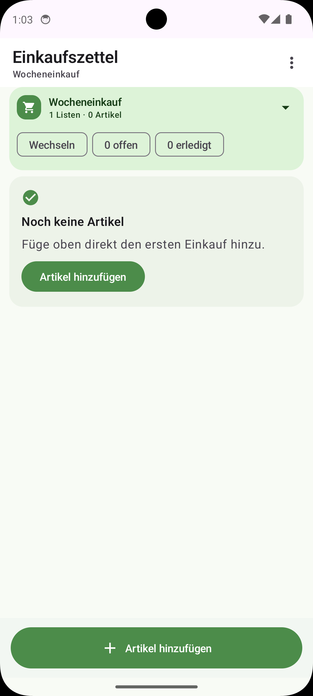
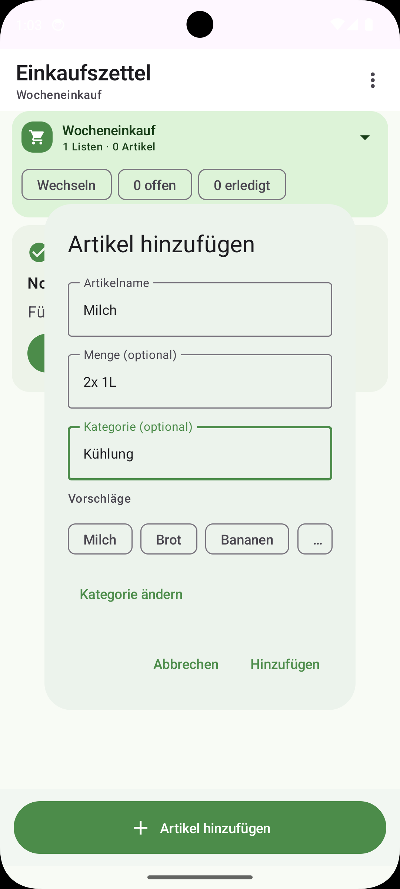
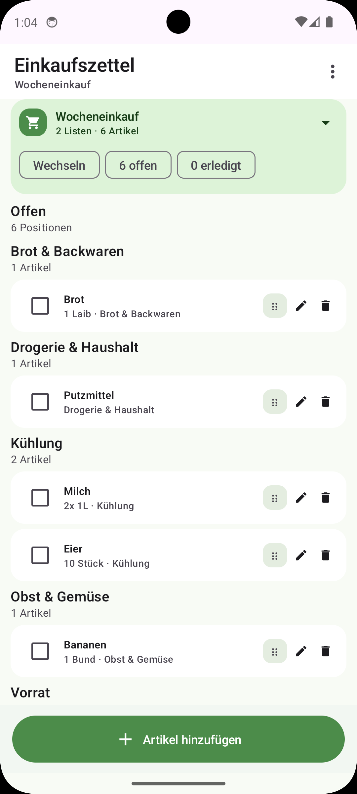
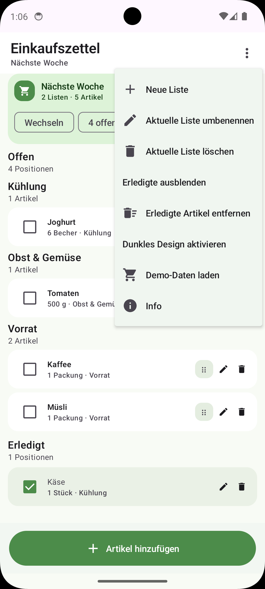
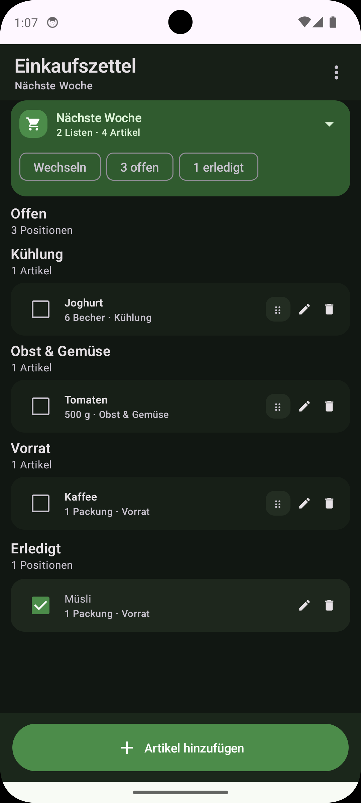

# Einkaufszettel

**Einkaufszettel** ist eine schlichte Android-App für deinen normalen Wocheneinkauf. Du kannst mehrere Listen führen, Artikel schnell hinzufügen, beim Einkaufen abhaken und erledigte Positionen gesammelt aufräumen.

## Warum diese App?

Die App ist bewusst ruhig, kompakt und alltagstauglich gehalten:
- schnell zu bedienen
- übersichtlich statt überladen
- komplett lokal auf dem Gerät
- ohne Cloud, Login oder Werbung

## Funktionen

- mehrere Einkaufslisten
- Standardliste **Wocheneinkauf** beim ersten Start
- Demo-Daten mit zwei echten Wochenlisten zum direkten Ausprobieren
- falls du noch eine alte leere App-Datenbank hast, wird sie beim Start automatisch durch die Demo ersetzt
- im Menü kannst du die Demo-Daten jederzeit manuell laden
- Artikel mit Menge und optionaler Kategorie, kompakt dargestellt; eigene Kategorien werden gelernt und später wieder angeboten; die offene Liste wird automatisch nach Kategorie gruppiert; angelegte Kategorien lassen sich wieder löschen
- Vorschläge im Artikeldialog lassen sich mit einem "Mehr"-Chip aufklappen
- Artikel abhaken, bearbeiten und löschen
- erledigte Artikel unten anzeigen oder ausblenden
- erledigte Artikel gesammelt entfernen
- häufige Artikel als Vorschläge in den Dialogen; überzählige Vorschläge lassen sich aus dem "Mehr"-Bereich entfernen
- helles und dunkles Material-3-Design mit Umschaltung im Drei-Punkte-Menü

## So sieht die App aus

- **Hauptscreen**: deine aktuelle Liste mit offenen und optional erledigten Artikeln
- **Listen-Auswahl**: oben über das Listen-Menü
- **Dialog „Artikel hinzufügen“**: Name, Menge, Kategorie und Vorschläge
- **Dialog „Artikel bearbeiten“**: dieselben Felder wie beim Hinzufügen
- **Menü**: Liste anlegen, umbenennen, löschen, erledigte Artikel ein-/ausblenden, erledigte Artikel entfernen, Info

## Screenshots

<p></p>
<p></p>
<p></p>
<p></p>
<p></p>


## Technik

- Kotlin
- Jetpack Compose
- Material 3
- Android Studio Projekt
- lokale JSON-Persistenz im internen App-Speicher

## Datenschutz

Deine Daten bleiben lokal auf dem Gerät. Die App braucht keine besonderen Berechtigungen und überträgt keine Nutzerdaten an externe Dienste.

## Build

```bash
./gradlew assembleDebug
```

## Projektstatus

- Kernfunktionen sind implementiert
- Debug-Build und JVM-Tests wurden erfolgreich geprüft
- grün-natürliches Farbschema, passendes Launcher-Icon und kompaktere Listenansicht sind gesetzt
- Demo-Daten mit zwei Wochenlisten sind eingebaut und per Menü neu ladbar

## In Android Studio öffnen

Öffne einfach den Ordner `Einkaufszettel` als Projekt. Das ist ein normales Android-Studio-Projekt mit einem App-Modul.
